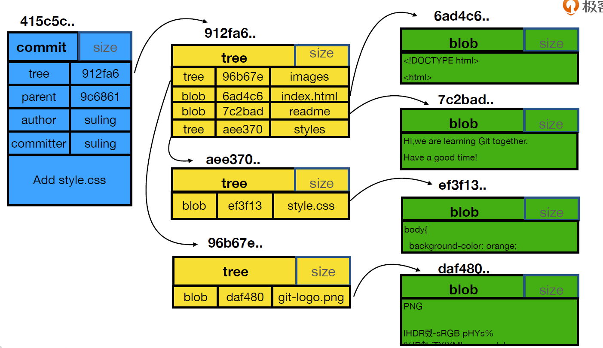
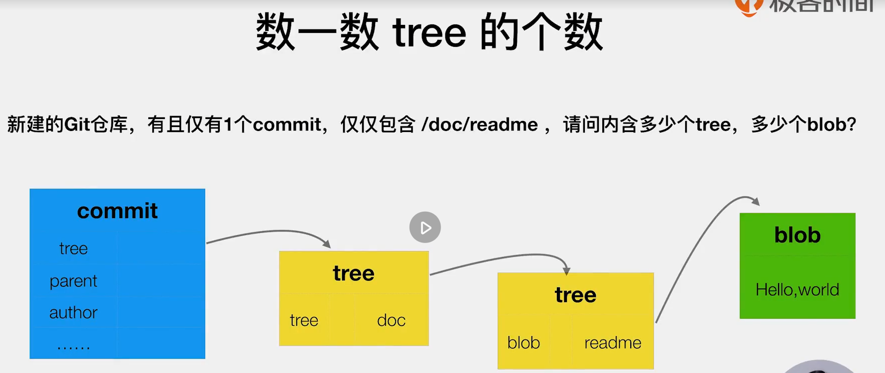

# 玩转Git三剑客

## 一、Git、Github、Gitlab 的区别

​	Git是一个开源的分布式版本控制系统，用于敏捷高效地处理任何或小或大的项目。它是 Linus Torvalds 为了帮助管理 Linux 内核开发而开发的一个开放源码的版本控制软件。

​	Github是在线的基于Git的代码托管服务。 GitHub是2008年由Ruby on Rails编写而成。GitHub同时提供付费账户和免费账户。这两种账户都可以创建公开的代码仓库，只有付费账户可以创建私有的代码仓库。 Gitlab解决了这个问题, 可以在上面创建免费的私人repo。 

## 二、Git 基础

### 1、 Git 安装配置

```shell
[root@qfedu.com ~]# yum -y install curl-devel expat-devel gettext-devel openssl-devel zlib-devel
[root@qfedu.com ~]# yum -y install git git-all git-core
[root@qfedu.com ~]# git --version
```

### 2、使用Git进行配置

​	添加最小配置: 

- `git config --local user.name 'youngpig'` 
- `git config --local user.email '873185434@qq.com'`

​	参数区别: 

- `git  config --local`      ##只对某个仓库有效,切换到另外一个仓库失效 
- `git  config --global`    ##当前用户的所有仓库有效,工作当中最常用 
- `git  config --sysstem`   ##系统的所有用户,几乎不用 

​	查看配置: 

- `git config --list --local`       ##只能在仓库里面起作用, 普通路径git不管理   
- `git config --list --global`     
- `git config --list --system`    

​	清除配置：

- `git config --unset --local user.name`
- `git config --unset --global user.name`
- `git config --unset --system user.name`

​	**local的在.git/config里面；global的在个人home目录下的.gitconfig里面；system应该在git安装目录的下**

### 3、Git基本概念

- **工作区**：就是你在电脑里能看到的目录。
- **暂存区**：英文叫stage, 或index。一般存放在"git目录"下的index文件（.git/index）中，所以我们把暂存区有时也叫作索引（index）。
- **版本库**：工作区有一个隐藏目录.git，这个不算工作区，而是Git的版本库。

　　工作区、版本库中的暂存区和版本库之间的关系的示意图：


- 　　图中左侧为工作区，右侧为版本库。在版本库中标记为 "index" 的区域是暂存区（stage, index），标记为 "master" 的是 master 分支所代表的目录树。 


- 　　图中我们可以看出此时 "HEAD" 实际是指向 master 分支的一个"游标"。


- 　　图中的 objects 标识的区域为 Git 的对象库，实际位于 ".git/objects" 目录下，里面包含了创建的各种对象及内容。 


- 　　当对工作区修改（或新增）的文件执行 `git add` 命令时，暂存区的目录树被更新，同时工作区修改（或新增）的文件内容被写入到对象库中的一个新的对象中，而该对象的ID被记录在暂存区的文件索引中。 


- 　　当执行提交操作（执行`git commit`）时，暂存区的目录树写到版本库（对象库）中，master 分支会做相应的更新。即 master 指向的目录树就是提交时暂存区的目录树。 

> `git add -A` 相对于`git add -u` 命令的优点 ： 可以提交所有被删除、被替换、被修改和新增的文件到数据暂存区，而`git add -u` 只能操作跟踪过的文件。`git add -A `等同于`git add -all`

### 4、常用的git 命令 

#### 给文件重命名的简便方法

`git mv oldFile newFile`          相当于`mv oldFile newFile`、`git add newFile`、`git rm oldFile`三步

#### 通过`git log`查看版本历史

- `git log --all` 查看所有分支的历史 
- `git log --all --graph` 查看图形化的 log 地址 
- `git log --oneline` 查看单行的简洁历史。 
- `git log --oneline -n4` 查看最近的四条简洁历史。
- `git log --oneline --all -n4 --graph` 查看所有分支最近 4 条单行的图形化历史。
- `git help --web log` 跳转到git log 的帮助文档网页

```shell
[root@qfedu.com ~]# git mv oldFile newFile        # 给文件重命名的简便方法，相当于mv、git add newFile、git rm oldFile
[root@qfedu.com ~]# git status                    # 查看现在暂存区的状况 
[root@qfedu.com ~]# git branch -v                 # 之查看所有本地分支
[root@qfedu.com ~]# git branch -av                # 查看所有分支情况,包括本地和远端
[root@qfedu.com ~]# git checkout -b [branch_name] # 创建新分支并切换到该分支
[root@qfedu.com ~]# git checkout -b [branch_name]  [remote_branch_name]# 创建新分支并切换到该分支，该分支基于指定的远端分支
[root@qfedu.com ~]# git reset --hard HEAD^        # 回到上一个版本 
[root@qfedu.com ~]# git reset --hard XXXXX        # XXX为版本编号，回到某一个版本
[root@qfedu.com ~]# git commit -am'xxx'           # 直接将所有文件添加到暂存区并且提交
[root@qfedu.com ~]# git remote -v                 # 查看远程版本库
[root@qfedu.com ~]# git remote add [shortname] [url] #添加远程版本库
[root@qfedu.com ~]# git pull origin master        # 从主分支pull到本地，远端仓库名为origin 
[root@qfedu.com ~]# git push -u origin master     # 从本地push到主分支 
[root@qfedu.com ~]# git pull                      # pull默认主分支 
[root@qfedu.com ~]# git push                      # push默认主分支
```

> 推荐大家看日志设置一个快捷键，在./git/config文件中添加：
>
> [alias] 
>
> ​	lg = log --color --graph --pretty=format:'%Cred%h%Creset -%C(yellow)%d%Creset %s %Cgreen(%cr) %C(bold blue)<%an>%Creset' --abbrev-commit
>
> [git push 的 -u 参数含义](https://blog.csdn.net/Lakers2015/article/details/111318801)

### 5、探秘 .Git 目录 

1、HEAD     ：   （指向当前所在的分支），例如当前在 develop 分支，实际指向地址是 refs/heads/develop

2、refs [文件夹] ，其中包含heads和tags两个子文件夹（还可能含有其他子文件夹）。

​	heads  ：存放当前项目的所有分支

​	tags     ：存放的当前项目的所有标签，又叫做里程碑

3、config   ：当前 git 的配置文件

4、objects [文件夹]    （存放所有的 git 对象，对象哈希值前 2 位作为文件夹名称，后 38 位作为对象文件名, 可通过 `git cat-file -p` 命令，拼接文件夹名称+文件名查看）

```shell
git cat-file -t  #查看 git 对象的类型
git cat-file -p  #查看 git 对象的内容
git cat-file -s  #查看 git 对象的大小
```

在Git中，有三个最重要的对象，分别是 **commit、 tree 和 blob**。



blob是唯一的。即使两个文件的内容一样，它们的blob id也是一样的，这么做的好处是节省了存储空间。



​	一共有4个对象，一个 commit 对象，两个 tree 对象，一个 blob 对象。

### 6、分离头指针情况下的注意事项

​	`git checkout commitId`：会出现分离头指针的情况，这种情况下比较危险，因为这个时候你提交的代码没有和分支对应起来，当切换到其他分支的时候(比如master分支)，容易丢失代码。

​	但是分离头指针也有它的应用场景，就是在自己做尝试或者测试的时候可以分离头指针，当尝试完毕没有用的时候可以随时丢弃，但是如果觉得尝试有用，那么可以新建一个分支，使用  `git branch <新分支的名称> commitId`

### 7、进一步理解HEAD和branch

​	参考：[git在回退版本时HEAD~和HEAD^的作用和区别](https://blog.csdn.net/albertsh/article/details/106448035)

# 三、独自使用 Git 时的常见场景

## 1、怎么删除不需要的分支

​	查看本地分支：

```shell
git branch  #前面带有*号的是当前分支
```


​	删除本地已合并的分支或者没有新改动的分支：

```shell
git branch -d [branchname]
```


​	强行删除分支：

```shell
git branch -D [branchName]
```

​	注意：
​		你是无法删除当前所在的分支的，因此，通常需要先切换到其他分支上：

```shell
git checkedout [branchName]
```

​	如果切换的分支已存在，就切换上去，否则就重新创建一个分支并切换上去。

​	在删除前Git会判断在该分支上开发的功能是否被merge的其它分支。如果没有，不能删除。如果merge到其它分支，但之后又在其上做了开发，使用-d还是不能删除。用-d 报“error：The branch is not fully merged”，是指这个分支不曾合入到其他任何分支。在日常开发中，我们通常赋予有意义的分支名，Git判断本分支没和任何别的分支合并，意味这删除存在风险。它也提供我们-D的方式，如果确定无风险就用-D 。

### GitHub删除远程分支

​	远程分支就是GitHub上创建的分支。删除远程分支其实是用push。
​	**注意：删除远程分支并不会删除本地分支**

```shell
git push origin --delete [branchname]
```

清理本地无效分支(远程已删除本地没删除的分支):

```shell
git fetch -p
```

参考：[Git分支的意义和使用方法](https://blog.csdn.net/qq_27674439/article/details/107412097)

## 2、怎么修改最新commit的message

​	`git commit --amend` 对最近提交的一次message做变更。

> 关于 git commit --amend 的编辑 Linux下 git默认的文本编辑器是nano，很多快捷键不熟悉，执行下面的命令可以将git的文本编辑器改为我们熟悉的vim。 使用`git config --global core.editor vim`

## 3、怎么修改老旧commit的message

​	修改历史的 Commit message，**通常用在还没有提交到集成分支之前**： `git rebase -i father_commit_id`  交互界面里的命令选 reword。

​	可以看到修改了老message后，自父亲commit以下，所有commit都变了。blob是只看内容的，两个文件如果内容相同，对应的blob是相同的，即使这俩文件在不同的git仓库。 但commit还包括commit的message，作者，变更时间，父亲等属性，这些中的一个发生变化了，在git眼里就是不同的commit。 如果前3个commit的message变了，前3个commit就变了，它一变，前2个commit的parent就变了，因此前2个commit也要变，依此类推。

​	git rebase工作的过程中，就是用了分离头指针。rebase意味着基于新base的commit来变更部分commits。它处理的时候，把HEAD指向base的commit，此时如果该commit没有对应branch，就处于分离头指针的状态，然后重新一个一个生成新的commit，当rebase创建完最后一个commit后，结束分离头状态，Git让HEAD指向变完基的分支名。

​	**那如果要更改的是第一次提交，执行 `git rebase -i --root` 即可**

## 4、怎样把连续的多个commit整理成1个

​	把连续的多个 Commit 合并为 1 个：

1. git rebase -i parent_commitId
2. 将前四个commit message前的pick改为 s，保存
3. 在新的页面最前面输入我们新的commit message

## 5、怎样把间隔的多个commit整理成1个

​	把间隔的多个 Commit 合并为 1 个：

1. git rebase -i parent_commitId
2. 将需要合并的commit移到需要合并到的commit的下一行，并且将"pick"改为"squash"，表示需要和前一行的commit合并。保存
3. 执行`git rebase --continue`
4. 在新的页面最前面输入我们新的commit message

## 6、怎么比较暂存区和HEAD所含文件的差异

​	可以使用`git diff --staged` 和 `git diff --cached`命令，他们两个是一样的。如果修改了多个文件，可以指定文件名的。不加就是比对所有文件差异。

## 7、怎么比较工作区和暂存区所含文件的差异

​	直接使用`git diff`命令即可。

## 8、如何让暂存区恢复成和HEAD一样

​	使用`git reset HEAD`命令即可。

​	`git reset` 有三个参数： 

- --soft 这个只是把 HEAD 指向的 commit 恢复到你指定的 commit，暂存区 工作区不变 
- --hard 这个是 把 HEAD， 暂存区， 工作区 都修改为  你指定的 commit 的时候的文件状态 
- --mixed 这个是不加时候的默认参数，把 HEAD，暂存区 修改为 你指定的 commit 的时候的文件状态，工作区保持不变

## 9、如何让工作区的文件恢复成和暂存区一样

​	以暂存区为中心 

- 暂存区与HEAD比较：`git diff --cached`
- 暂存区与工作区比较:  `git diff` 
- 暂存区恢复成HEAD : `git reset HEAD` 
- 暂存区覆盖工作区修改：`git checkout` 

## 10、怎样取消暂存区部分文件的更改

​	`git reset HEAD -- [file_name]`

## 11、消除最近几次的提交

1. 先`git reflog`  查看命令历史, 记录每次的命令。
2. 然后进行你想找回的commit
3. `git reset --hard commit_id`

## 12、看看不同提交的指定文件的差异

​	`git diff [commit_name1] [commit_name2] -- [file_name]`    或

​	`git diff [branch_name1] [branch_name2] -- [file_name]`    

## 13、正确删除文件的方法

​	`git rm [filename]`

## 14、开发中临时加塞了紧急任务如何处理

​	参考：[Git stash命令详解和使用](https://blog.csdn.net/qq_38425719/article/details/107792754)

​	使用`git stash pop`时，可以指定选择任意一个进行pop，不是一定要按照入stash的顺序进行pop。

## 15、如何指定不需要git管理的文件

​	.gitignore之前， 要保证仓库中没有这个文件。

> 假设第一次想上传到git，不然其他人拉不到，然后远程有了后，再进行gitignore的话要怎么操作？
>
> ​	答: 1）git rm 把不再需要git管理的文件删除掉。 2）.gitignore 里面加上该文件。

## 16、如何将Git仓库备份到本地

​	参考：[Git小技巧——git的bare裸库命令操作——一看就会](https://blog.csdn.net/u013541707/article/details/107482045?spm=1001.2101.3001.6661.1&utm_medium=distribute.pc_relevant_t0.none-task-blog-2~default~CTRLIST~Rate-1-107482045-blog-81743626.pc_relevant_aa&depth_1-utm_source=distribute.pc_relevant_t0.none-task-blog-2~default~CTRLIST~Rate-1-107482045-blog-81743626.pc_relevant_aa&utm_relevant_index=1)	

​	本地有哑协议和智能协议，使用方法如下：

- 哑协议：`git clone --bare /Users/young/git-learning/.git ya.git`
- 智能协议：`git clone --bare file:///Users/young/git-learning/.git zhineng.git`

参考：[git push命令](https://www.runoob.com/git/git-push.html)	

​			[git remote命令](https://www.runoob.com/git/git-remote.html)

# 四、Git与Github 的简单同步

## 1、把本地仓库同步到GitHub

参考：[Git 远程仓库(Github)](https://www.runoob.com/git/git-remote-repo.html)

​		  [git fetch和git pull的区别](https://blog.csdn.net/weixin_42343307/article/details/121239170)

​	**什么是fast-forward模式：举个例子，本地分支往远端分支做push，如果远端分支不是本地分支的祖先，那它俩就不是 fast forward 了。反之，它俩就是fast forward的关系。**

​	PS：`git merge`会有多个父节点，而`git rebase`是以线性树形式构成的，所以每个节点只有一个父节点。

# 五、Git多人单分支集成协作时的常见场景

## 1、不同人修改了不同文件如何处理

​	使用`git clone`时，本地仓库只会产生clone时所在的branch，比如基于master分支clone时，本地只会有master分支。此时，可以通过`git branch -av`查看所有分支，会发现仓库中有许多其他的remote分支。假如有一个remote/origin/feature/add_git_commands远端分支，此时可以使用`git checkout -b feature/add_git_commands origin/feature/add_git_commands` 命令产生一个基于该远端分支的本地分支。

​	每次push本地代码之前pull一下远端代码，然后再push，基本就没有问题了。

## 2、不同人修改了同文件的不同区域如何处理

​	同上一点一样，先pull一下远端代码，然后再push。当然，也可以分两步走，即先fetch，再merge。merge是不会发生冲突问题的，因为虽然修改的是同一个文件，但是文件中的位置不一样。

## 3、不同人修改了同文件的同一区域如何处理	

​	git使用原则：

1. push前一定先pull 
2. 合并代码必须两人结对 
3. 合并冲突，非自己的变动保持原样，和自己冲突的代码找相应的代码提交人确认如何解决冲突 
4. 合并完成后，保证本地能编译能运行再push 
5. 合并到主干的代码必须通过测试，必须通过代码review 
6. 不同的功能从主干上拉新分支进行开发工作 
7. 分支的命名需要加上，拉取人＋拉取说明 
8. 上完线的分支要及时清理

## 4、同时变更了文件名和文件内容如何处理

​	前面章节讲git的文件存储时，说git存放blob文件时是以文件内容来区分的，并不以文件名来区分；此处的变更文件名操作和变更文件内容的操作能够自动被git处理，原因就在于blob文件并没有发生修改的冲突吧？如果其中一个人既变更了文件名又修改了文件，同时另一个人也修改了该文件的同一位置的内容，就会被git识别为冲突，而不能自动进行处理了。

## 5、把同一文件改成了不同的文件名如何处理

​	git的处理是会报冲突错误，让我们自行解决。可以使用`git status`查看一下状态，然后做出相应的修改。

# 六、Git集成使用禁忌

## 1、禁止向集成分支执行push -f操作

## 2、禁止向集成分支执行变更历史的操作

# 七、初识GitHub

# 八、使用GitHub进行团队协作

## 1、GitHub提交 pull request 的流程

1. 注册github账号

2. fork期望提交的开源项目（可以是个人也可以是组织）

3. 使用`git clone`从自己账号clone项目到本地（项目为步骤2中fork的项目）

4. 切换分支，完成自己想要的修改

5. 创建commit，并进行提交

   ```shell
   git add .
   git commit -m 'commit title'
   git push origin HEAD
   ```

6. 切换到 github 页面，点击`Compare & pull request`按钮创建 pull request

7. 等待项目维护者合并或者给出修改意见

8. 如果存在修改意见，则重复步骤五的操作，并再次提交

9. pull request 合并之后，会在自己的项目上看到状态，点击`sync`同步最新代码

10. pull request 提交完成

# 九、GitLab实践


# 附录

## 正常的git提交流程

如下所示：

```shell
echo "# elastic-web-operator" >> README.md
git init
git add README.md
git commit -m "first commit"
git branch -M main
git remote add origin git@github.com:Youngpig1998/elasticweb-operator.git
git push -u origin main
```

Note：更新代码之后，在commit后push前要先pull一下代码


如果你本地的分支名称和远程名称相同，则使用以下命令：

```
git push origin [branchName]
```


如果本地的分支跟远程的分支不一样，则指定本地和远程的分支的名称：

```
git push origin localBranchName:remoteBranchName
```


## Git的branch和tag的区别

tag 对应某次 commit, 是一个点，是不可移动的。
branch 对应一系列 commit，是很多点连成的一根线，有一个HEAD 指针，是可以依靠 HEAD 指针移动的。

所以，两者的区别决定了使用方式，改动代码用 branch ,不改动只查看用 tag。

tag 和 branch 的相互配合使用，有时候起到非常方便的效果，例如 已经发布了 v1.0 v2.0 v3.0 三个版本，这个时候，我突然想不改现有代码的前提下，在 v2.0 的基础上加个新功能，作为 v4.0 发布。就可以 检出 v2.0 的代码作为一个 branch ，然后作为开发分支。


## 如何在本地添加删除Tag，并push到Github

```shell
#删除本地tag
git tag -d <tagname> 

#删除远端tag
git push origin --delete <tagname>  

#向远端推送本地tag
git push origin <tagname>

#向远端推送本地所有tag
git push origin --tags

# 查看commit详情，可以看到commit id
git log

#给某一次的commit打上tag
git tag v0.9 6df3aa614a45e687697a628a9174106822f79bfc

#可以用git show <tagname>查看标签信息：
git show testtag

```


## 修改GitHub仓库名称

1. 打开仓库地址，点击Settings
2. 更改仓库名称
3. 回到本地，通过以下命令查看之前的仓库名

```shell
#查看结果：
git remote -v

origin	git://github.com/Chloeqq/learngit.git (fetch)
origin	git://github.com/Chloeqq/learngit.git (push)

#通过以下命令进行修改
git remote set-url origin git@github.com:Chloeqq/Pytest_Auto_APi_Master.git

#查看结果:
git remote -v 

origin	git@github.com:Chloeqq/Pytest_Auto_APi_Master.git (fetch)
origin	git@github.com:Chloeqq/Pytest_Auto_APi_Master.git (push)

#通过以下命令，推送仓库
git push -u origin master   

```


## [Commit 相关的 3 个重要内容](./commit-message)


