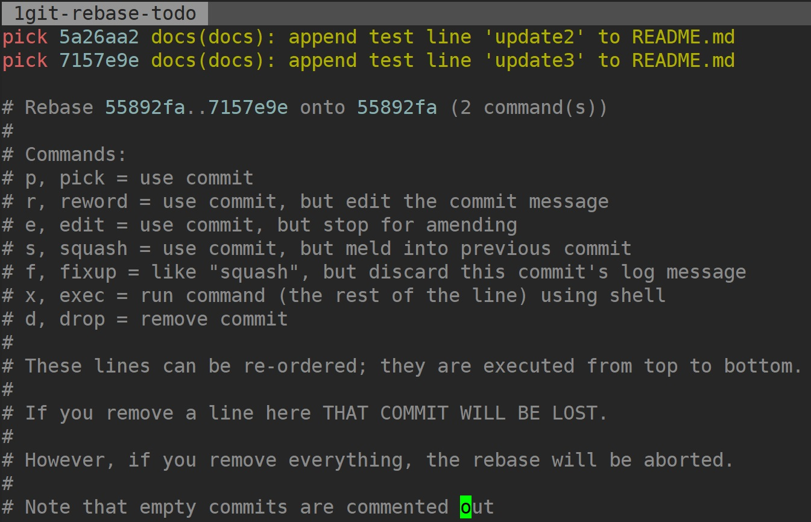
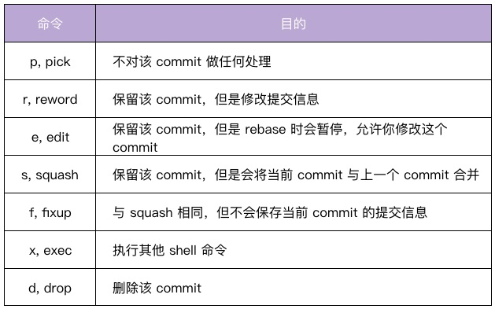
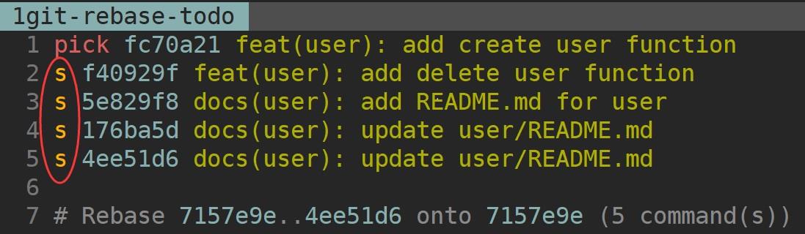
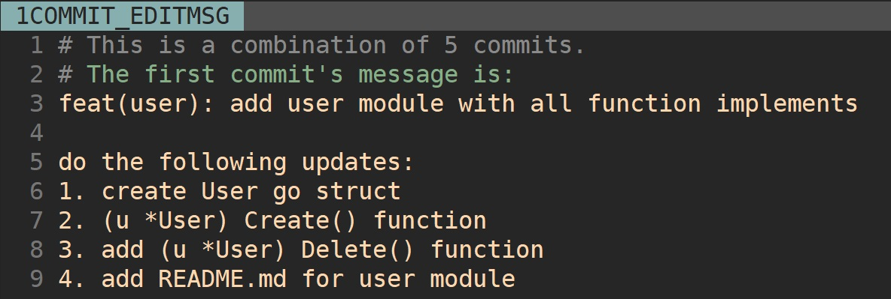
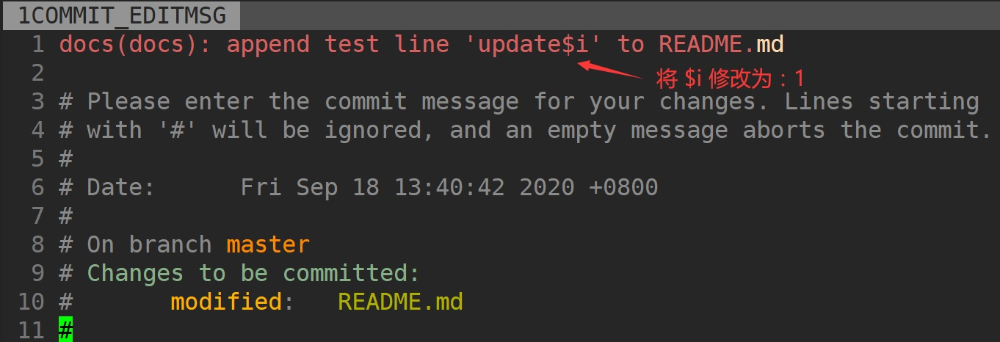
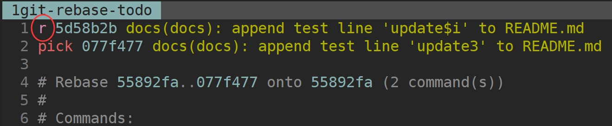
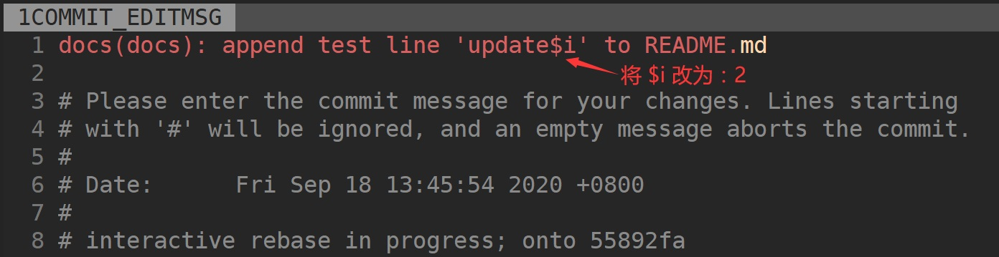

# Commit 相关的 3 个重要内容


## 提交频率

​	在实际项目开发中，如果是个人项目，随意 commit 可能影响不大，但如果是多人开发的项目，随意 commit 不仅会让 Commit Message 变得难以理解，还会让其他研发同事觉得你不专业。因此，我们要规定 commit 的提交频率。那到底什么时候进行 commit 最好呢？

​	我认为主要可以分成两种情况。一种情况是，只要我对项目进行了修改，一通过测试就立即 commit。比如修复完一个 bug、开发完一个小功能，或者开发完一个完整的功能，测试通过后就提交。另一种情况是，我们规定一个时间，定期提交。这里我建议代码下班前固定提交一次，并且要确保本地未提交的代码，延期不超过 1 天。这样，如果本地代码丢失，可以尽可能减少丢失的代码量。

​	按照上面 2 种方式提交代码，你可能会觉得代码 commit 比较多，看起来比较随意。或者说，我们想等开发完一个完整的功能之后，放在一个 commit 中一起提交。这时候，我们可以在最后合并代码或者提交 Pull Request 前，执行 `git rebase -i` 合并之前的所有 commit。那么如何合并 commit 呢？

## 合并提交

​	合并提交，就是将多个 commit 合并为一个 commit 提交。这里，我建议你把新的 commit 合并到主干时，只保留 2~3 个 commit 记录。那具体怎么做呢？在 Git 中，我们主要使用 `git rebase` 命令来合并。`git rebase` 也是我们日后开发需要经常使用的一个命令，所以我们一定要掌握好它的使用方法。


### git rebase 命令介绍

​	`git rebase` 的最大作用是它可以重写历史。我们通常会通过 `git rebase -i <commit ID>`使用 `git rebase` 命令，-i 参数表示交互（interactive），该命令会进入到一个交互界面中，其实就是 Vim 编辑器。在该界面中，我们可以对里面的 commit 做一些操作，交互界面如图所示：



​	这个交互界面会首先列出给定<commit ID>**之前（不包括，越下面越新）**的所有 commit，每个 commit 前面有一个操作命令，默认是 pick。我们可以选择不同的 commit，并修改 commit 前面的命令，来对该 commit 执行不同的变更操作。git rebase 支持的变更操作如下：



​	在上面的 7 个命令中，**squash 和 fixup 可以用来合并 commit**。例如用 squash 来合并，我们只需要把要合并的 commit 前面的动词，改成 squash（或者 s）即可。你可以看看下面的示例：

```
pick 07c5abd Introduce OpenPGP and teach basic usage
s de9b1eb Fix PostChecker::Post#urls
s 3e7ee36 Hey kids, stop all the highlighting
pick fa20af3 git interactive rebase, squash, amend
```

​	rebase 后，第 2 行和第 3 行的 commit 都会合并到第 1 行的 commit。这个时候，我们提交的信息会同时包含这三个 commit 的提交信息：

```
# This is a combination of 3 commits.
# The first commit's message is:
Introduce OpenPGP and teach basic usage

# This is the 2ndCommit Message:
Fix PostChecker::Post#urls

# This is the 3rdCommit Message:
Hey kids, stop all the highlighting
```

​	如果我们将第 3 行的 squash 命令改成 fixup 命令：

```
pick 07c5abd Introduce OpenPGP and teach basic usage
s de9b1eb Fix PostChecker::Post#urls
f 3e7ee36 Hey kids, stop all the highlighting
pick fa20af3 git interactive rebase, squash, amend
```

​	rebase 后，还是会生成两个 commit，第 2 行和第 3 行的 commit，都合并到第 1 行的 commit。但是，新的提交信息里面，第 3 行 commit 的提交信息会被注释掉：

```
# This is a combination of 3 commits.
# The first commit's message is:
Introduce OpenPGP and teach basic usage

# This is the 2ndCommit Message:
Fix PostChecker::Post#urls

# This is the 3rdCommit Message:
# Hey kids, stop all the highlighting
```

​	除此之外，我们在使用 git rebase 进行操作的时候，还需要注意以下几点：

- 删除某个 commit 行，则该 commit 会丢失掉。

- 删除所有的 commit 行，则 rebase 会被终止掉。

- 可以对 commits 进行排序，git 会从上到下进行合并。

  

为了加深你的理解，我给你完整演示一遍合并提交。

### 合并提交操作示例

​	假设我们需要研发一个新的模块：user，用来在平台里进行用户的注册、登录、注销等操作，当模块完成开发和测试后，需要合并到主干分支，具体步骤如下。

​	**首先，我们新建一个分支。**我们需要先基于 master 分支新建并切换到 feature 分支：

```shell
$ git checkout -b feature/user
Switched to a new branch 'feature/user'
```

​	这是我们的所有 commit 历史：

```shell
$ git log --oneline
7157e9e docs(docs): append test line 'update3' to README.md
5a26aa2 docs(docs): append test line 'update2' to README.md
55892fa docs(docs): append test line 'update1' to README.md
89651d4 docs(doc): add README.md
```

​	接着，我们在 feature/user分支进行功能的开发和测试，并遵循规范提交 commit，功能开发并测试完成后，Git 仓库的 commit 记录如下：

```shell
$ git log --oneline
4ee51d6 docs(user): update user/README.md
176ba5d docs(user): update user/README.md
5e829f8 docs(user): add README.md for user
f40929f feat(user): add delete user function
fc70a21 feat(user): add create user function
7157e9e docs(docs): append test line 'update3' to README.md
5a26aa2 docs(docs): append test line 'update2' to README.md
55892fa docs(docs): append test line 'update1' to README.md
89651d4 docs(doc): add README.md
```

​	可以看到我们提交了 5 个 commit。接下来，我们需要将 feature/user分支的改动合并到 master 分支，但是 5 个 commit 太多了，我们想将这些 commit 合并后再提交到 master 分支。

​	**接着，我们合并所有 commit。**在上一步中，我们知道 fc70a21是 feature/user分支的第一个 commit ID，其父 commit ID 是 7157e9e，我们需要将7157e9e之前的所有分支 进行合并，这时我们可以执行：

```shell
$ git rebase -i 7157e9e
```

​	执行命令后，我们会进入到一个交互界面，在该界面中，我们可以将需要合并的 4 个 commit，都执行 squash 操作，如下图所示：



​	修改完成后执行:wq 保存，会跳转到一个新的交互页面，在该页面，我们可以编辑 Commit Message，编辑后的内容如下图所示：



​	#开头的行是 git 的注释，我们可以忽略掉，在 rebase 后，这些行将会消失掉。修改完成后执行:wq 保存，就完成了合并提交操作。

​	除此之外，这里有 2 个点需要我们注意：

- `git rebase -i <commid ID>`这里的一定要是需要合并 commit 中最旧 commit 的父 commit ID。
- 我们希望将 feature/user 分支的 5 个 commit 合并到一个 commit，在 git rebase 时，需要保证其中最新的一个 commit 是 pick 状态，这样我们才可以将其他 4 个 commit 合并进去。

​	**然后，我们用如下命令来检查 commits 是否成功合并。**可以看到，我们成功将 5 个 commit 合并成为了一个 commit：d6b17e0。

```shell
$ git log --oneline
d6b17e0 feat(user): add user module with all function implements
7157e9e docs(docs): append test line 'update3' to README.md
5a26aa2 docs(docs): append test line 'update2' to README.md
55892fa docs(docs): append test line 'update1' to README.md
89651d4 docs(doc): add README.md
```

​	**最后，我们就可以将 feature 分支** feature/user 的改动合并到主干分支，从而完成新功能的开发。

```shell
$ git checkout master
$ git merge feature/user
$ git log --oneline
d6b17e0 feat(user): add user module with all function implements
7157e9e docs(docs): append test line 'update3' to README.md
5a26aa2 docs(docs): append test line 'update2' to README.md
55892fa docs(docs): append test line 'update1' to README.md
89651d4 docs(doc): add README.md
```

​	这里给你一个小提示，如果你有太多的 commit 需要合并，那么可以试试这种方式：先撤销过去的 commit，然后再建一个新的。

```

$ git reset HEAD~3
$ git add .
$ git commit -am "feat(user): add user resource"
```

​	需要说明一点：除了 commit 实在太多的时候，一般情况下我不建议用这种方法，有点粗暴，而且之前提交的 Commit Message 都要重新整理一遍。

## 修改 Commit Message

​	即使我们有了 Commit Message 规范，但仍然可能会遇到提交的 Commit Message 不符合规范的情况，这个时候就需要我们能够修改之前某次 commit 的 Commit Message。具体来说，我们有两种修改方法，分别对应两种不同情况：

1. `git commit --amend`：修改最近一次 commit 的 message；
2. `git rebase -i`：修改某次 commit 的 message。

接下来，我们分别来说这两种方法。

### git commit --amend：修改最近一次 commit 的 message

​	有时候，我们刚提交完一个 commit，但是发现 commit 的描述不符合规范或者需要纠正，这时候，我们可以通过 git commit --amend 命令来修改刚刚提交 commit 的 Commit Message。具体修改步骤如下：

1. 查看当前分支的日志记录。

```shell
$ git log –oneline
418bd4 docs(docs): append test line 'update$i' to README.md
89651d4 docs(doc): add README.md
```

​	可以看到，最近一次的 Commit Message 是 docs(docs): append test line 'update$i' to README.md，其中 update$i 正常应该是 update1。

2.  更新最近一次提交的 Commit Message

​	在当前 Git 仓库下执行命令：`git commit --amend`，后会进入一个交互界面，在交互界面中，修改最近一次的 Commit Message，如下图所示：



​	修改完成后执行:wq 保存，退出编辑器之后，会在命令行显示，该 commit 的 message 的更新结果如下：

```
[master 55892fa] docs(docs): append test line 'update1' to README.md
 Date: Fri Sep 18 13:40:42 2020 +0800
 1 file changed, 1 insertion(+)
```

​	查看最近一次的 Commit Message 是否被更新

```shell
$ git log --oneline
55892fa docs(docs): append test line 'update1' to README.md
89651d4 docs(doc): add README.md
```

​	可以看到最近一次 commit 的 message 成功被修改为期望的内容。

### git rebase -i：修改某次 commit 的 message

​	如果我们想修改的 Commit Message 不是最近一次的 Commit Message，可以通过 `git rebase -i <父 commit ID>`命令来修改。这个命令在实际开发中使用频率比较高，我们一定要掌握。具体来说，使用它主要分为 4 步。

1. 查看当前分支的日志记录。

```shell
$ git log --oneline
1d6289f docs(docs): append test line 'update3' to README.md
a38f808 docs(docs): append test line 'update$i' to README.md
55892fa docs(docs): append test line 'update1' to README.md
89651d4 docs(doc): add README.md
```

​	可以看到倒数第 3 次提交的 Commit Message 是：docs(docs): append test line 'update$i' to README.md，其中 update$i 正常应该是 update2。

2. 修改倒数第 3 次提交 commit 的 message。

​	在 Git 仓库下直接执行命令 **`git rebase -i 55892fa`**，然后会进入一个交互界面。在交互界面中，修改最近一次的 Commit Message。这里我们使用 reword 或者 r，保留倒数第 3 次的变更信息，但是修改其 message，如下图所示：



​	修改完成后执行:wq 保存，还会跳转到一个新的交互页面，如下图所示：



​	修改完成后执行:wq 保存，退出编辑器之后，会在命令行显示该 commit 的 message 的更新结果：

```
[detached HEAD 5a26aa2] docs(docs): append test line 'update2' to README.md
 Date: Fri Sep 18 13:45:54 2020 +0800
 1 file changed, 1 insertion(+)
Successfully rebased and updated refs/heads/master.
```

​	Successfully rebased and updated refs/heads/master. 说明 rebase 成功，其实这里完成了两个步骤：更新 message，更新该 commit 的 HEAD 指针。

​	**注意：这里一定要传入想要变更 Commit Message 的父 commit ID：git rebase -i <父 commit ID>。**

3. 查看倒数第 3 次 commit 的 message 是否被更新。

```shell
$ git log --oneline
7157e9e docs(docs): append test line 'update3' to README.md
5a26aa2 docs(docs): append test line 'update2' to README.md
55892fa docs(docs): append test line 'update1' to README.md
89651d4 docs(doc): add README.md
```

​	可以看到，倒数第 3 次 commit 的 message 成功被修改为期望的内容。

​	这里有两点需要你注意：

- Commit Message 是 commit 数据结构中的一个属性，如果 Commit Message 有变更，则 commit ID 一定会变，git commit --amend 只会变更最近一次的 commit ID，但是 git rebase -i 会变更父 commit ID 之后所有提交的 commit ID。
- **如果当前分支有未 commit 的代码，需要先执行 git stash 将工作状态进行暂存，当修改完成后再执行 git stash pop 恢复之前的工作状态。**


# 总结

1. 介绍 angular 规范，包括，type，scope，subject，body，footer。    
2.  开发手写 angular 规范的 commit message 几乎是不可能的，需要工具来帮助。   
3. commitzen-go 以交互的方式，帮助程序员生成 angular 规范的 commit message    
4. 通过 git hooks, 检查 commit message 规范，不符合时，git commit 执行失败   
5.  压缩 commit message 、修改 commit message ，都可以借助 git rebase -i 命令   
6. 基于 commit message, 使用 git-chglog 自动生成 CHANGELOG    
7. gsemver 自动生成语义化版本号，感觉和 angular message 规范，关系不大。